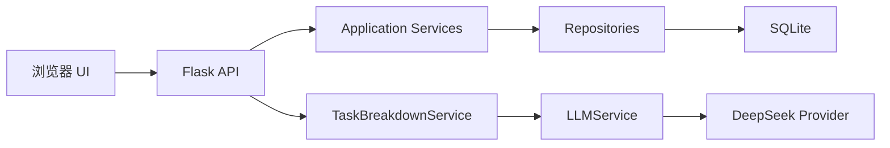

# Yantu（研途）

Yantu 是一个面向研究生科研、课程与个人生活的本地优先时间管理工作台。它以浏览器作为交互界面，以 Flask 提供本机服务，并将任务数据保存在本地 SQLite 数据库中：无需账号，也不依赖公网服务器。

项目当前处于 `v0.2.0` 开发阶段。基础任务管理、AI 任务拆解和本地可靠启动已经可用；Project、Task、TimeEntry 的模型、兼容迁移、Repository 与 Service 分层已经完成，项目和时间记录的完整 API/UI 仍在后续路线图中。

## 核心能力

- 今日、收件箱、科研、课程、个人、未来 7 天和月历视图
- 任务新建、编辑、删除、完成、筛选、优先级与 Deadline 管理
- 预计/实际耗时、状态、进度、标签、重复规则和备注
- 父子任务结构，以及 Project、TimeEntry 数据模型基础
- JSON 备份导入与导出
- AI 任务拆解预览：模型生成后先展示，只有用户确认才写入 SQLite
- 旧版 SQLite 字段的无损迁移与新旧字段兼容同步
- 仅监听 `127.0.0.1`，支持端口回退、健康检查和安全关闭
- Windows 双击启动，固定使用 Conda `planner`（Python 3.11）

## 系统架构

Yantu 保持清晰的单向依赖：HTTP 层负责协议和输入输出，Service 负责编排与校验，Repository 负责持久化，SQLite 负责本地数据保存。



AI 预览阶段不会修改数据库；确认阶段会再次校验结果，并在一个事务中写入父任务和子任务。详细设计见 [docs/architecture.md](docs/architecture.md)。

## 数据模型

| 模型 | 当前职责 |
| --- | --- |
| Project | 项目名称、描述、类别及创建/更新时间 |
| Task | 项目关联、父子层级、优先级、状态、Deadline、预计/实际工时 |
| TimeEntry | 任务关联、开始/结束时间、持续时间和备注 |

数据库默认位于 `data/yantu.db`。启动时会执行幂等迁移：保留旧字段和已有数据，并同步 `due_date/deadline`、分钟/小时、旧/新时间字段。数据库版本高于当前程序支持版本时只会给出兼容风险提示，不会由旧程序降级或改写。

## 快速开始（Windows）

### 1. 准备环境

Yantu 唯一支持的本地 Python 环境是 Conda `planner`，版本为 Python 3.11：

```powershell
conda create -n planner python=3.11
conda activate planner
pip install -r requirements.txt
```

环境只需创建一次。后续依赖发生变化时，在 `planner` 中重新执行安装命令即可。

### 2. 启动与停止

- 双击根目录的 `start.bat` 启动。
- 按启动窗口中的 `Ctrl+C`，或双击 `stop.bat` 停止。

启动器不会调用系统 PATH 中的其他 Python，也不会从项目内的 `vendor` 目录加载依赖。它会定位 `planner` 的 `python.exe`，检查 Python 版本和运行依赖，等待健康检查成功后再打开浏览器。默认尝试 `127.0.0.1:8765`，端口被占用时自动回退。

也可以在已激活的 `planner` 环境中直接启动：

```powershell
python server.py --no-browser
```

## 配置 AI

AI 功能默认使用 DeepSeek，API Key 仅从本地 `.env` 读取，不会写入代码或 Git。

1. 复制 `.env.example` 为 `.env`。
2. 填写配置：

   ```ini
   YANTU_LLM_PROVIDER=deepseek
   DEEPSEEK_API_KEY=你的密钥
   DEEPSEEK_BASE_URL=https://api.deepseek.com
   DEEPSEEK_MODEL=deepseek-v4-flash
   YANTU_AI_TIMEOUT_SECONDS=60
   ```

3. 重启 Yantu，进入“AI 任务拆解”。
4. 输入任务并生成预览，检查后再确认写入。

`.env` 已被 `.gitignore` 排除。请勿将密钥粘贴到 Issue、日志、截图或提交记录中。

## 本地开发与测试

安装运行与开发依赖：

```powershell
conda activate planner
pip install -r requirements-dev.txt
```

运行完整测试：

```powershell
pytest
```

`requirements-dev.txt` 同时包含运行依赖和 pytest。测试通过 `src` 布局加载项目，不依赖本地 `vendor` 目录。

## 目录结构

```text
Yantu/
├── src/yantu/
│   ├── ai/                     # Provider、Prompt、Schema 与 LLM 门面
│   ├── api/                    # Flask API 蓝图
│   ├── database/
│   │   ├── models.py           # Project、Task、TimeEntry 与枚举
│   │   ├── repositories/       # 按实体划分的数据访问层
│   │   └── repository.py       # SQLite 初始化、迁移与兼容门面
│   ├── services/               # 业务校验和用例编排
│   ├── web/                    # 无构建步骤的 HTML/CSS/JavaScript 前端
│   └── main.py                 # Flask 应用与本地服务入口
├── scripts/                    # Windows 启停脚本
├── tests/                      # API、迁移、Repository、Service 与 AI 测试
├── docs/architecture.md
├── pyproject.toml
└── requirements-dev.txt
```

## 数据与安全边界

- 数据库：`data/yantu.db`
- 运行状态：`data/runtime.json`
- 本地秘密：`.env`
- 网络监听：仅 `127.0.0.1`
- AI 预览：不写数据库
- AI 确认：Schema 复验后事务写入
- 高版本数据库：保留版本并提示风险，旧程序不执行降级迁移

数据库、运行状态、日志和密钥均不会提交到 Git。

## 路线图

- Project CRUD API、项目页面与项目任务视图
- TimeEntry API、计时器和投入统计
- AI 拆解结果逐项编辑、选择性确认与 Deadline 建议
- OpenAI、Qwen 与 Ollama Provider
- 科研课题、番茄钟、周期总结、周报/月报与风险提醒

## 参与贡献

开始贡献前请阅读 [CONTRIBUTING.md](CONTRIBUTING.md) 和 [SECURITY.md](SECURITY.md)。项目采用 [MIT License](LICENSE)。
