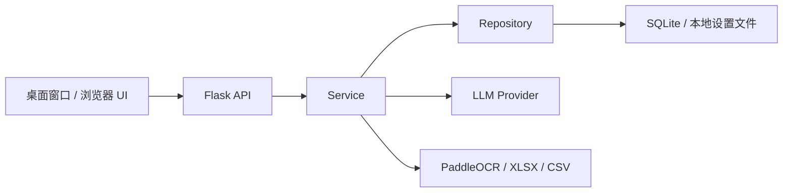

<div align="center">
  

# Yantu · 研途

**面向研究生科研、课程与个人生活的本地优先时间管理工作台**

把任务、课表、专注记录和每日规划放在同一个离线可控的空间中。


[快速开始](#快速开始) · [主要功能](#主要功能) · [使用指南](#使用指南) · [开发与测试](#开发与测试) · [系统架构](#系统架构)
</div>

---

Yantu 以 Windows 桌面窗口提供交互，内部继续复用 Flask 本地应用，并将数据保存在本机 SQLite 数据库中。它不需要账号或云数据库，适合管理论文阅读、实验、课程、汇报和长期研究任务。

**v0.2.1** 提供可直接安装的 Windows 桌面版，并重点完善可恢复的专注工作台、安全设置中心和本地数据边界。

## 为什么使用 Yantu

| 特点 | 说明 |
| --- | --- |
| 本地优先 | 任务、课表、规划和外观设置保存在本机，不依赖云端账号 |
| 面向科研 | 支持项目、父子任务、预计/实际工时、长期任务和 Deadline |
| 尊重现实日程 | 自动规划会避开课程，并插入任务切换和休息时间 |
| 人工确认优先 | 课表识别、AI 拆解和每日规划均先预览，确认后才写入数据库 |
| 低使用门槛 | Windows 安装版无需 Conda、Python、Node.js 或命令行 |

## 快速开始

### Windows 安装版（推荐）

1. [直接下载 Yantu 0.2.1 Windows 安装包](https://github.com/coronaBorealis/Yantu/raw/main/downloads/Yantu-Setup-0.2.1-x64.exe)。
2. 双击 `Yantu-Setup-0.2.1-x64.exe`，按向导安装。
3. 从桌面或开始菜单打开 **Yantu 研途**。

安装版支持 64 位 Windows 10/11，按当前用户安装，不要求管理员权限。卸载应用不会删除 `%LOCALAPPDATA%\Yantu` 中的任务、课表和设置；建议仍定期从设置中心导出 JSON 备份。

桌面窗口使用系统的 Microsoft Edge WebView2 Runtime。Windows 10/11 通常已包含该组件；若启动时提示缺失，请从 [Microsoft WebView2](https://developer.microsoft.com/microsoft-edge/webview2/) 安装 Evergreen Runtime。

> 安装包由 Windows 构建工作流生成，并随仓库保存对应的 [SHA-256 校验文件](https://github.com/coronaBorealis/Yantu/raw/main/downloads/Yantu-Setup-0.2.1-x64.exe.sha256)。Windows 可能对尚未进行商业代码签名的新应用显示 SmartScreen 提示，请只从本仓库下载并核对校验值。

### 从源码运行

参与开发时请使用名为 `planner` 的统一 Conda 环境：

```powershell
conda create -n planner python=3.11
conda activate planner
pip install -r requirements.txt
```

安装依赖后，可双击仓库根目录的 `start.bat`。它会定位 `planner` 环境、启动仅监听 `127.0.0.1` 的服务，并打开浏览器。默认地址为 `http://127.0.0.1:8765`；端口被占用时会自动尝试其他端口。

也可以在终端中启动：

```powershell
conda activate planner
python server.py --no-browser
```

停止应用时，在启动窗口按 `Ctrl+C`，或双击 `stop.bat`。

### 源码版桌面快捷方式

双击 `install-shortcut.bat`，可为源码版创建或更新 **Yantu 研途** 桌面快捷方式。正式安装版会由安装向导创建桌面和开始菜单快捷方式。

## 主要功能

### 任务与科研工作管理

- 今日、收件箱、科研、课程、个人、未来 7 天和月历视图
- 任务状态、优先级、Deadline、标签、备注和重复规则
- Project 关联与父子任务层级
- 预计工时、实际工时和 TimeEntry 专注记录
- 软删除、回收站、恢复及二次确认后的永久删除
- 任务卡片右键菜单和移动端“⋯”操作入口

### 每日规划与适当休息

- 长期任务按剩余工作量和剩余日期动态计算今日建议投入
- 页面可见时每分钟校准动态投影，跨小时更新 Deadline 风险，跨日自动重算建议投入
- 多任务按优先级、Deadline 和今日工作量自动排序
- 自动避开课程等固定事件，并预留切换缓冲
- 支持 25/5、50/10 番茄节奏和自由专注
- 支持短休息、长休息、连续专注上限和工作时段设置
- 规划结果先预览、后确认；预览不会写入数据库
- 已确认时间表在任务进度变化后会提示重新规划，不会静默覆盖用户决定

### Zotero 科研文献工作流

- 优先连接本机 Zotero API，离线读取个人或群组文库，无需 API Key
- 可选连接 Zotero Web API；Key 仅保存到 Windows 凭据管理器
- 使用 Zotero 文库版本增量同步，并处理远端删除和文库身份变化
- 论文以外部 Key 幂等更新，支持 Zotero 客户端直达链接
- Task 可关联参考、待读、综述、引用或产出论文
- 科研项目可按 Zotero 文件夹整批导入论文，并可选择递归包含子文件夹
- 支持按论文标题、作者或年份检索，预览勾选后导入指定科研项目
- 项目论文以 Zotero Item Key 幂等关联，重复导入会自动跳过
- 新收集论文进入独立科研收件箱，经可编辑预览和人工确认后转成阅读任务
- 当前同步为只读和手动触发，不修改 Zotero，不下载附件或解析 PDF 全文

### 专注工作台

- 环形倒计时与自由正向计时，可关联任务和已确认的计划块
- 25/5、50/10、规划偏好和自定义时长快捷入口
- 暂停、恢复、刷新及程序重启后继续；到时先等待人工确认
- 专注后可自动进入短休息，四轮后使用长休息，休息结束不擅自开启下一轮
- 提示音、一分钟前提醒和可选系统通知；通知不可用时自动回退到页面标题与 Toast
- 今日/最近 7 天专注分钟、番茄数、暂停次数、任务与领域分布、预计/实际偏差
- 完成记录统一写入 TimeEntry，并同步任务实际投入，避免两套工时口径

### 课表识别与课程日历

- 导入 PNG、JPG、XLSX 和 CSV 课表
- 支持学期、节次、起止周、单双周和指定周规则
- 识别低置信度提示、重复导入检测和时间冲突警告
- 导入前可修改或删除识别条目，确认后单事务写入
- 课程与任务共同显示在今日、未来 7 天和月历中
- 支持跳过单次课程，不破坏整学期重复规则

### AI 辅助任务拆解

- 将较大的科研任务拆解为 3–8 个可执行子任务
- 校验模型返回的 JSON、优先级、预计工时和 Deadline
- Preview/Confirm 两阶段流程，模型不能直接修改数据库
- 当前提供 DeepSeek Provider，密钥保存在 Windows 凭据管理器，环境变量可作为更高优先级覆盖

### 外观与本地体验

- 研林、纸页、晨雾和夜航四套主题
- 浅色、深色和跟随系统模式
- 纯色、渐变及本地图片背景
- 根据背景亮度自动调整文字和面板，保障正文可读性
- 浏览器 favicon、应用 Logo 和 Windows 桌面图标

## 使用指南

### 安排一个长期任务

1. 新建任务并填写预计耗时与 Deadline。
2. 如任务不应立即开始，可设置开始日期。
3. 如果希望任务立即进入自动规划，将状态设为“等待”；即使没有单独设置开始日期，Yantu 也会从今天到 Deadline 动态分摊。普通“未开始”任务仍尊重开始日期，不会被擅自提前。
4. 在“今日时间轴”选择“安排今日”，检查课程避让、任务顺序和休息安排。
5. 确认后保存时间表；也可以从任务菜单直接开始专注。

今日建议投入的核心计算为：

```text
剩余工作量 = max(预计耗时 - 实际耗时, 0)
今日建议投入 = ceil(剩余工作量 / 今天至 Deadline 的剩余天数)
```

“今日建议投入”不是写死的数据。页面保持打开时会定期向本地服务重新计算；跨日、完成一次专注或修改工时后，剩余天数和每日投入会变化。已确认的时间轴若与新投影不一致，会显示重新规划提示。已逾期任务会提示用户重新安排。

### 导入课表

1. 打开侧栏中的“课表”，选择“导入课表”。
2. 选择文件，并填写学期起止日期。
3. 核对课程名、教师、地点、星期、节次、时间和周次。
4. 修正高亮字段或删除错误条目。
5. 确认后写入课程日历。

CSV 推荐列名：

```text
课程名称,教师,地点,星期,节次,周次,开始时间,结束时间
```

时间列可以省略，Yantu 会使用默认节次时间补全。

#### 启用本地图片 OCR

图片识别是可选能力，不影响普通启动和测试：

```powershell
conda activate planner
pip install -r requirements-ocr.txt
```

PaddleOCR 首次使用时可能下载模型，之后在本机运行。未安装 OCR 依赖时，XLSX 和 CSV 导入仍可正常使用。

### 配置 AI

打开 **设置中心 → AI**，粘贴 DeepSeek API Key 并点击“保存 AI 设置”。Yantu 使用 Windows Credential Manager 保存密钥；读取设置、导出备份和前端缓存都不会返回完整 Key。可直接点击“测试连接”验证认证和所选模型。

开发或自动化环境仍可通过 `.env` 配置；环境变量优先于设置中心，此时界面只显示“由环境变量管理”，不会覆盖其内容：

```ini
YANTU_LLM_PROVIDER=deepseek
DEEPSEEK_API_KEY=你的密钥
DEEPSEEK_BASE_URL=https://api.deepseek.com
DEEPSEEK_MODEL=deepseek-v4-flash
YANTU_AI_TIMEOUT_SECONDS=60
```

`.env` 已被 Git 忽略；请勿把密钥粘贴到 Issue、日志、截图或提交记录中。

### 连接 Zotero

推荐使用不经过互联网的本机连接：

1. 打开 Zotero，在“设置 → 高级”启用“允许本机其他应用与 Zotero 通信”。
2. 在 Yantu 打开“设置中心 → Zotero”，选择“本机 Zotero”。
3. 个人文库无需填写 ID；群组文库填写数字 Group ID。
4. 点击“测试连接”，成功后选择“立即同步”。
5. 打开侧栏“科研文献”，检查新论文；点击“创建阅读任务”，修改耗时、Deadline 和优先级后确认。

将论文直接整理到科研项目：

1. 打开“科研文献”，创建或选择一个“科研”类型项目。
2. 点击“从 Zotero 导入论文”。
3. 选择 Zotero 文件夹并决定是否包含子文件夹，或切换为标题/作者/年份检索。
4. 在预览中取消不需要的论文，再确认导入。
5. 导入只在 Yantu 中建立项目—论文关联，不修改 Zotero，也不会自动创建任务。

如果 Zotero 不在本机运行，可选择 Web API，填写 Zotero 账户页面显示的数字 User/Group ID，并创建一个仅供 Yantu 读取的专用 API Key。Key 使用请求头发送并保存在 Windows 凭据管理器，不会进入 JSON 备份。

同步不会直接生成任务，也不会修改 Zotero。远端新增论文只进入科研收件箱；任务必须经过人工确认后才写入 SQLite。

### 备份与恢复

应用支持 JSON 备份导入与导出。当前备份格式包含：

- 任务和回收站条目
- 学期、课程、上课规则和课程例外
- 规划偏好与已确认的规划批次
- 已结束的专注历史与允许备份的非秘密设置
- 任务级规划约束、科研文献题录、科研收件箱、任务—论文和项目—论文关联
- 外观设置，以及可选的 Base64 本地背景

API Key、活动中的计时和本机请求令牌不会进入备份。

导入流程继续兼容旧版仅包含任务的备份。

## 系统架构

Yantu 保持单向分层，不允许 API 绕过业务层直接操作数据库：



```text
src/yantu/
├── ai/                     # Prompt、Schema、Provider 和 LLM 门面
├── api/                    # Flask API 蓝图
├── database/
│   ├── models.py           # 核心领域模型与枚举
│   ├── repositories/       # 实体数据访问层
│   └── repository.py       # SQLite 初始化、迁移与兼容门面
├── services/               # 业务校验与用例编排
├── web/                    # 原生 HTML、CSS 和 JavaScript 前端
├── desktop.py              # pywebview 桌面入口与单实例控制
└── main.py                 # 应用装配与本地服务入口
```

详细设计、数据流和边界说明见 [docs/architecture.md](docs/architecture.md)。

### 核心数据模型

| 领域 | 模型 |
| --- | --- |
| 任务 | Project、Task、TimeEntry |
| 课程 | Semester、Course、CourseMeeting、CourseException |
| 规划 | PlanningProfile、PlanningRun、PlanBlock |
| 专注与设置 | FocusSession、AppSetting |

源码开发时数据库默认位于 `data/yantu.db`，当前 Schema 版本为 `5`。迁移只追加表或字段，不删除旧字段和已有数据；高版本数据库不会被旧程序降级。

规划数据从设计上支持 `rule`、`ai` 和 `manual` 三种来源。未来接入新的 AI 排程 API 时，仍需输出同一 Preview 结构，并经过人工确认和服务层复验后才能保存。

## 开发与测试

安装开发依赖：

```powershell
conda activate planner
pip install -r requirements-dev.txt
```

运行完整测试：

```powershell
pytest
```

测试覆盖数据库迁移、Repository/Service、任务与课程 API、AI JSON 校验、课表导入、外观设置、专注记录和多任务规划。普通测试不会下载 OCR 模型，也不访问网络。

前端采用原生 HTML/CSS/JavaScript，无需安装 Node.js 或执行前端构建。

### 构建 Windows 安装包

安装 Inno Setup 后，在 `planner` 环境安装构建依赖并执行：

```powershell
conda activate planner
pip install -r requirements-build.txt
.\scripts\build-installer.ps1
```

脚本会生成 PyInstaller onedir 桌面程序，执行冻结版自检，编译中英双语 Inno Setup 安装器，再完成一次静默安装、启动自检和卸载。产物位于 `dist/installer/`，并附带 SHA-256 文件。推送 `v*` 标签时，GitHub Actions 会重复执行测试与构建，并保留可下载的工作流 Artifact；面向普通用户的已验证安装器同步在 `downloads/`。

## 数据与安全

| 数据 | 默认位置或边界 |
| --- | --- |
| 安装版持久数据 | `%LOCALAPPDATA%\Yantu` |
| 源码版 SQLite 数据库 | `data/yantu.db` |
| 源码版外观与背景 | `data/appearance.json`、`data/appearance/` |
| 源码版运行状态 | `data/runtime.json` |
| API 密钥 | Windows Credential Manager（环境变量可覆盖） |
| 服务监听 | 仅 `127.0.0.1` |

路径解析遵循以下优先级：`YANTU_DATA_DIR` → 安装版 `%LOCALAPPDATA%\Yantu` → 源码开发仓库 `data/`。PyInstaller 程序资源保持只读，数据库、外观、WebView 状态和其他用户数据全部位于独立可写目录；覆盖安装与卸载不会主动删除用户数据。

- 数据库、日志、运行状态和密钥不会提交到 Git。
- 所有本地修改型 API 都要求本次启动随机生成的同源请求令牌，减少浏览器页面误调用本机服务的风险。
- 课表文件仅在本机请求期间处理，临时文件会在处理后删除。
- 图片背景保存在本机，不上传第三方。
- 常规删除默认进入回收站；永久删除需要再次确认。
- AI 拆解、课表导入和时间规划的预览阶段均不会写入数据库。

## 项目状态与路线图

当前重点是稳定本地科研时间管理闭环。后续计划包括：

- Project 管理页面与更完整的项目视图
- TimeEntry 历史、周统计和预计/实际偏差复盘
- 时间块拖拽、锁定和跨日重新排程
- 课程关联作业、考试提醒和下一节课程卡片
- AI “稳妥 / 平衡 / 冲刺”规划方案对比
- OpenAI、Qwen 和 Ollama Provider
- 快速添加、全局搜索和键盘命令面板

## 参与贡献

提交修改前，请先阅读 [CONTRIBUTING.md](CONTRIBUTING.md) 和 [SECURITY.md](SECURITY.md)。项目采用 [MIT License](LICENSE)。
