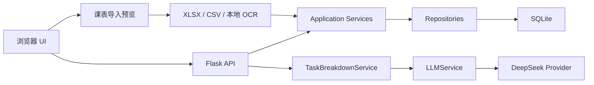

# Yantu（研途）

Yantu 是一个面向研究生科研、课程与个人生活的本地优先时间管理工作台。它以浏览器作为交互界面，以 Flask 提供本机服务，并将任务数据保存在本地 SQLite 数据库中：无需账号，也不依赖公网服务器。

项目当前处于 `v0.2.0` 开发阶段。除基础任务管理和 AI 任务拆解外，Yantu 已支持中文高校课表导入、学期周次、单双周课程、课程日程融合以及可恢复删除。

## 核心能力

- 今日、收件箱、科研、课程、个人、未来 7 天和月历视图
- 任务新建、编辑、删除、完成、筛选、优先级与 Deadline 管理
- 预计/实际耗时、状态、进度、标签、重复规则和备注
- 父子任务结构，以及 Project、TimeEntry 数据模型基础
- JSON 备份导入与导出
- PNG/JPG 本地课表识别，以及 XLSX/CSV 课表导入
- 学期、节次、周次范围、单双周和指定周课程规则
- 识别结果预览、修改、冲突提醒与确认后事务写入
- 课程与任务共同显示在今日、未来 7 天和月历中
- 任务和课程右键菜单、移动端“⋯”入口、撤销与回收站
- AI 任务拆解预览：模型生成后先展示，只有用户确认才写入 SQLite
- 旧版 SQLite 字段的无损迁移与新旧字段兼容同步
- 仅监听 `127.0.0.1`，支持端口回退、健康检查和安全关闭
- Windows 双击启动，固定使用 Conda `planner`（Python 3.11）
- 四套主题、系统浅深色跟随与本地自定义背景，自动保障文字可读性
- “研字山径印章”应用图标、浏览器 favicon 与一键桌面快捷方式
- 长期任务按开始日至 Deadline 动态分摊每日建议投入，避免把总工时全部压到第一天
- 25/5、50/10 番茄钟与不使用番茄节拍的自由专注模式
- 多任务自动排程：按优先级与 Deadline 排序，避开课程，并插入短休息、长休息和切换缓冲
- 规划结果先预览再确认，保存可审计的规划批次与时间块，为后续 AI 排程复用

## 系统架构

Yantu 保持清晰的单向依赖：HTTP 层负责协议和输入输出，Service 负责编排与校验，Repository 负责持久化，SQLite 负责本地数据保存。



AI 预览阶段不会修改数据库；确认阶段会再次校验结果，并在一个事务中写入父任务和子任务。详细设计见 [docs/architecture.md](docs/architecture.md)。

## 数据模型

| 模型 | 当前职责 |
| --- | --- |
| Project | 项目名称、描述、类别及创建/更新时间 |
| Task | 项目关联、父子层级、优先级、状态、Deadline、预计/实际工时 |
| TimeEntry | 任务关联、开始/结束时间、持续时间和备注 |
| Semester | 学期日期、时区与节次时间映射 |
| Course | 课程名称、教师、地点、颜色和学期关联 |
| CourseMeeting | 星期、节次、周次范围与单双周规则 |
| CourseException | 跳过某一次课程等单次例外 |
| PlanningProfile | 工作时段、专注长度、休息节奏、课程缓冲和工作日偏好 |
| PlanningRun | 一次规则/AI/人工规划的输入快照、警告、策略和确认状态 |
| PlanBlock | 关联任务的专注块，以及短休息、长休息和切换缓冲 |

数据库默认位于 `data/yantu.db`。当前 Schema 版本为 `4`。启动时只追加课程表、软删除和规划所需的表/列，保留旧字段和已有数据，并继续同步新旧兼容字段。高版本数据库只提示风险，不会被旧程序降级。

## 导入课程表

1. 打开侧栏“课表”，选择“导入课表”。
2. 选择 PNG、JPG、XLSX 或 CSV 文件，并填写学期起止日期。
3. 核对课程名称、教师、地点、星期、节次、时间和周次规则。
4. 修正低置信度或无效条目，取消不需要的课程，再确认导入。

预览阶段不会写入 SQLite；确认时整份课表在一个事务中保存。重复文件会被识别，时间重叠会提示但不会强制阻止导入。图片只在本机临时处理，请仍在导入后人工核对结果。

CSV 推荐列名为 `课程名称,教师,地点,星期,节次,周次,开始时间,结束时间`。时间列可省略，Yantu 会使用默认节次时间补全。

### 启用图片识别

图片 OCR 是独立能力包，不影响基础开发环境和离线测试：

```powershell
conda activate planner
pip install -r requirements-ocr.txt
```

PaddleOCR 模型会在第一次识别图片时下载，之后在本机运行。未安装 OCR 依赖时，XLSX 和 CSV 导入仍然可用。

## 快速开始（Windows）

### 1. 准备环境

Yantu 唯一支持的本地 Python 环境是 Conda `planner`，版本为 Python 3.11：

```powershell
conda create -n planner python=3.11
conda activate planner
pip install -r requirements.txt
```

环境只需创建一次。后续依赖发生变化时，在 `planner` 中重新执行安装命令即可。

### 2. 启动与停止

- 双击根目录的 `start.bat` 启动。
- 按启动窗口中的 `Ctrl+C`，或双击 `stop.bat` 停止。

希望从桌面直接启动时，双击一次 `install-shortcut.bat`。它只会在当前用户桌面创建或更新 `Yantu 研途` 快捷方式，不修改注册表或开始菜单；以后双击桌面图标即可启动服务并打开浏览器。

启动器不会调用系统 PATH 中的其他 Python，也不会从项目内的 `vendor` 目录加载依赖。它会定位 `planner` 的 `python.exe`，检查 Python 版本和运行依赖，等待健康检查成功后再打开浏览器。默认尝试 `127.0.0.1:8765`，端口被占用时自动回退。

也可以在已激活的 `planner` 环境中直接启动：

```powershell
python server.py --no-browser
```

## 配置 AI

AI 功能默认使用 DeepSeek，API Key 仅从本地 `.env` 读取，不会写入代码或 Git。

1. 复制 `.env.example` 为 `.env`。
2. 填写配置：

   ```ini
   YANTU_LLM_PROVIDER=deepseek
   DEEPSEEK_API_KEY=你的密钥
   DEEPSEEK_BASE_URL=https://api.deepseek.com
   DEEPSEEK_MODEL=deepseek-v4-flash
   YANTU_AI_TIMEOUT_SECONDS=60
   ```

3. 重启 Yantu，进入“AI 任务拆解”。
4. 输入任务并生成预览，检查后再确认写入。

`.env` 已被 `.gitignore` 排除。请勿将密钥粘贴到 Issue、日志、截图或提交记录中。

## 本地开发与测试

安装运行与开发依赖：

```powershell
conda activate planner
pip install -r requirements-dev.txt
```

运行完整测试：

```powershell
pytest
```

`requirements-dev.txt` 同时包含运行依赖和 pytest。测试通过 `src` 布局加载项目，不依赖本地 `vendor` 目录。

## 外观与本地背景

侧栏“外观设置”提供研林、纸页、晨雾和夜航四套预设，可选择浅色、深色或跟随系统。背景支持纯色、双色渐变，以及不超过 8 MB 的 PNG、JPG、WebP 图片。

所有更改会先在弹窗中实时预览，只有“保存外观”才会写入本机。Yantu 会抽样分析图片明暗，并在浅/深文字体系与面板遮罩之间自动调整，使普通正文对比度达到 WCAG AA 的 4.5:1。设置保存在 `data/appearance.json`，图片保存在 `data/appearance/`，不会上传第三方；JSON 备份可选择性携带 Base64 图片并在另一份本地数据库中恢复。

## 每日工时与专注计时

“预计耗时”表示任务完整生命周期的总工作量，不再直接等同于今天的工作量。首页按以下规则计算“今日建议投入”：

- 有开始日期和 Deadline：以 `预计耗时 - 实际耗时` 为剩余量，从今天到 Deadline 按剩余日历天数动态均摊。
- Deadline 是今天：今天承接全部剩余量。
- 已逾期：在逾期区域显示，提醒重新安排或尽快处理。
- 只有未来 Deadline、尚未设置开始日期：不会擅自从今天开始计时。
- 专注记录写入 TimeEntry 后，会同步增加任务实际耗时，下一次计算自动降低剩余建议投入。

顶部“专注”按钮和任务右键菜单都可以启动计时：

- `25 / 5`：25 分钟专注，完成后进入 5 分钟休息。
- `50 / 10`：适合阅读论文、编程或实验数据处理的长专注。
- `自由专注`：不使用番茄钟，正向计时，结束时仍可记录实际投入。

计时器状态保存在当前浏览器本地缓存，收起面板或刷新页面不会立即丢失；完成的专注时间通过 `/api/time-entries` 保存到 SQLite。

### 生成今日时间表

在首页“今日时间轴”选择“安排今日”：

1. 设置可工作时段、单次专注、短/长休息、最长连续工作时间和课程前后缓冲。
2. 生成预览。规则引擎先排列紧急与高优先级任务，再按 Deadline 和当天建议投入安排其他任务。
3. 课程被视为不可占用的固定时间，前后按偏好留出缓冲。
4. 检查专注、休息、未安排分钟数和容量警告。
5. 确认后写入规划批次；未确认的预览不修改数据库。

关闭番茄节拍后，系统不会机械地在每个工作块后加入番茄休息，但仍会插入切换缓冲，并在达到最长连续专注时间后安排长休息。规则引擎和未来 AI 都使用相同 Preview/Confirm 数据结构，AI 不会获得绕过人工确认直接写库的特殊通道。

## 目录结构

```text
Yantu/
├── src/yantu/
│   ├── ai/                     # Provider、Prompt、Schema 与 LLM 门面
│   ├── api/                    # Flask API 蓝图
│   ├── database/
│   │   ├── models.py           # Project、Task、TimeEntry 与枚举
│   │   ├── repositories/       # 按实体划分的数据访问层
│   │   └── repository.py       # SQLite 初始化、迁移与兼容门面
│   ├── services/               # 业务校验和用例编排
│   ├── web/                    # 无构建步骤的 HTML/CSS/JavaScript 前端
│   └── main.py                 # Flask 应用与本地服务入口
├── scripts/                    # Windows 启停脚本
├── assets/brand/               # Logo 生成母版
├── tests/                      # API、迁移、Repository、Service 与 AI 测试
├── docs/architecture.md
├── pyproject.toml
├── requirements-dev.txt
└── requirements-ocr.txt        # 可选的本地图片识别依赖
```

## 数据与安全边界

- 数据库：`data/yantu.db`
- 运行状态：`data/runtime.json`
- 外观设置：`data/appearance.json` 与 `data/appearance/`
- 本地秘密：`.env`
- 网络监听：仅 `127.0.0.1`
- AI 预览：不写数据库
- AI 确认：Schema 复验后事务写入
- 课表文件：仅在本机解析，临时文件在请求结束后删除
- 删除：默认移入回收站；永久删除需要再次确认
- 高版本数据库：保留版本并提示风险，旧程序不执行降级迁移

数据库、运行状态、日志和密钥均不会提交到 Git。

## 路线图

- Project CRUD API、项目页面与项目任务视图
- TimeEntry 历史明细、编辑界面与按周投入统计
- 课程关联作业、考试提醒与下一节课程入口
- 时间块拖拽、锁定与跨日重新排程
- AI 拆解结果逐项编辑、选择性确认与 Deadline 建议
- OpenAI、Qwen 与 Ollama Provider
- 科研课题、番茄钟、周期总结、周报/月报与风险提醒

### 后续体验优化优先级

1. AI 规划解释与方案对比：在现有容量预警、课程避让和 Preview/Confirm 基础上，对比“稳妥、平衡、冲刺”方案。参考 [Sunsama Daily Planning](https://help.sunsama.com/docs/usage-guides/daily-planning/)。
2. 快速添加与命令面板：提供 `Q` 新建、`/` 搜索和 `?` 快捷键帮助，减少视图切换。参考 [Todoist Quick Add](https://www.todoist.com/zh-CN/help/articles/use-task-quick-add-in-todoist-va4Lhpzz)。
3. 专注复盘：基于现有 TimeEntry 汇总中断次数、预计与实际偏差，不建立另一套记录。
4. 下一节课程卡片：首页显示下一门课程、剩余时间、地点和关联待办，复用当前课表数据。

暂不增加“每个领域独立背景”，避免设置层级膨胀；当前采用全局一致主题。按列表自定义背景可参考 [Microsoft To Do](https://support.microsoft.com/en-US/ToDo/customize-your-lists)，待视图语义稳定后再评估。

## 参与贡献

开始贡献前请阅读 [CONTRIBUTING.md](CONTRIBUTING.md) 和 [SECURITY.md](SECURITY.md)。项目采用 [MIT License](LICENSE)。
