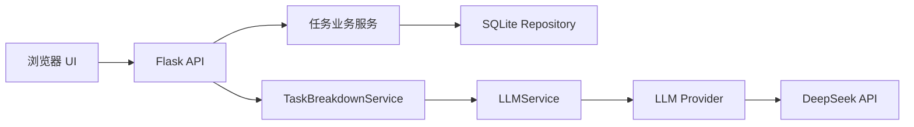
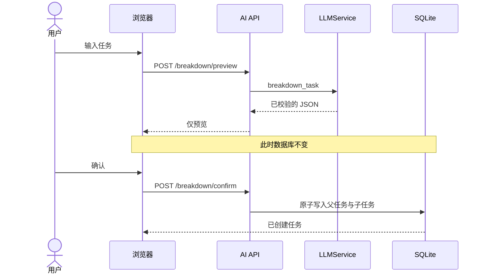

# Yantu 架构

## 目标与边界

Yantu 是 local-first 的单用户 Web 应用：Flask 提供本地 API 与静态资源，SQLite 负责持久化，浏览器负责交互。当前不引入 Node.js、Docker、云数据库或账号系统。

依赖方向固定为 `API -> Service -> Interface/Repository`。任务业务代码不导入任何具体模型 SDK，也不处理 API Key。

## AI 边界

- `ai/schemas.py`：模型输出的可信边界。所有返回值在进入业务层前进行类型与范围校验。
- `ai/prompt_templates.py`：集中管理 Prompt，避免散落在路由和任务代码中。
- `ai/llm_service.py`：统一 `generate()` 接口、环境配置、错误类型和 DeepSeek Provider。
- `services/task_breakdown_service.py`：任务拆解用例。预览阶段只返回数据，确认阶段才创建父任务和子任务。
- `api/ai_routes.py`：输入校验和 HTTP 状态码映射，不保存密钥、不记录请求头。

未来 Provider 需实现 `name`、`model` 与 `generate(prompt) -> LLMResponse`，再加入环境工厂。OpenAI、Qwen 和 Ollama 的认证、端点与响应差异只存在于各自 Provider 内。

## 数据与安全

- 默认数据库：`data/yantu.db`
- 本地秘密：`.env`
- 运行状态：`data/runtime.json`
- 服务地址：仅 `127.0.0.1`
- AI 预览不会自动写入；确认数据会再次经过 Schema 校验，并在一个 SQLite 事务中保存。

