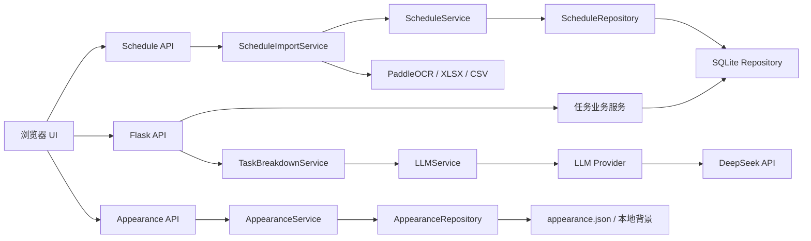
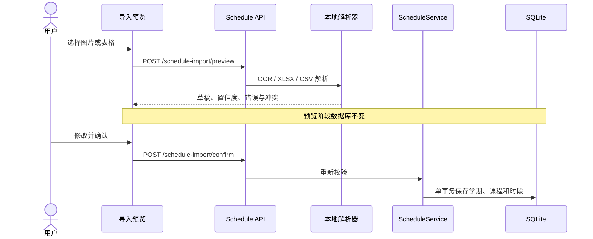
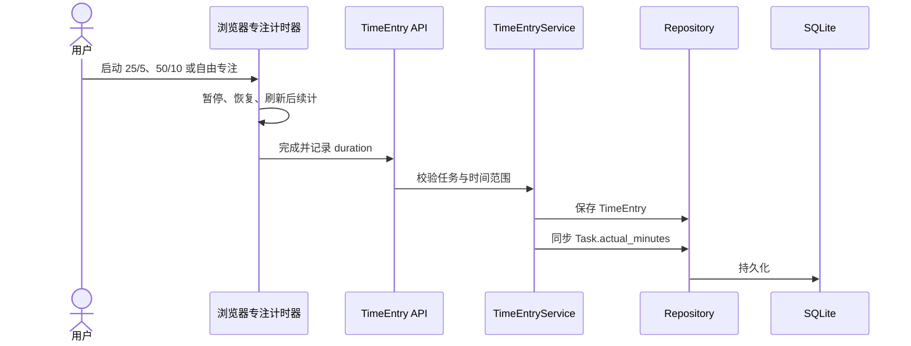
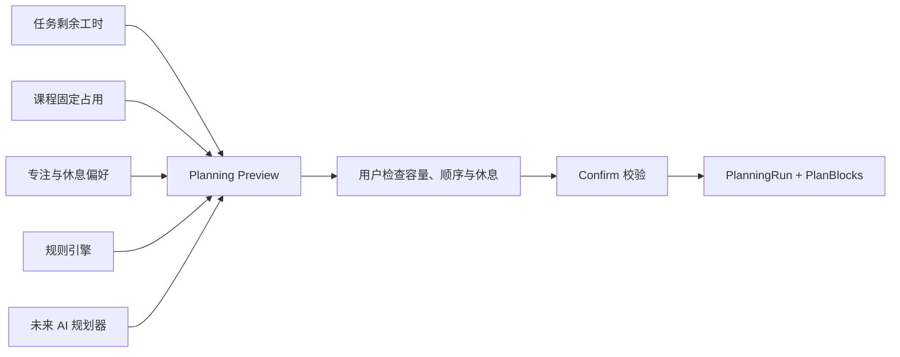
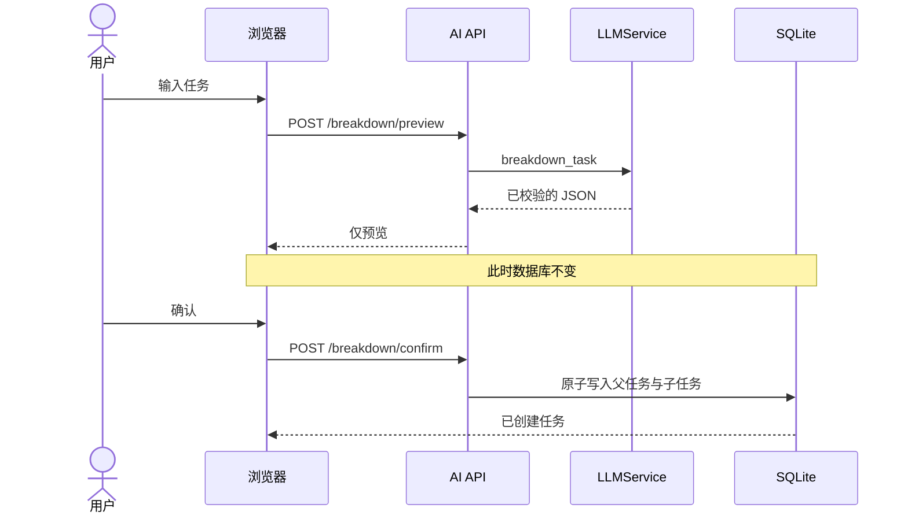

# Yantu 架构

## 目标与边界

Yantu 是 local-first 的单用户 Web 应用：Flask 提供本地 API 与静态资源，SQLite 负责持久化，浏览器负责交互。当前不引入 Node.js、Docker、云数据库或账号系统。



依赖方向固定为 `API -> Service -> Interface/Repository`。任务业务代码不导入任何具体模型 SDK，也不处理 API Key。

## 课程日程边界

课程是固定时间事件，不是可完成的 Task。数据库保存学期、课程和重复规则，`ScheduleService` 只在查询日期范围内展开实际课程实例，避免为整学期预先生成大量记录。



- 图片 OCR 通过接口注入并懒加载；普通启动和自动测试不下载模型。
- 课程周规则支持全部、单周、双周和指定周。
- `CourseException` 保存“跳过本次”，不会破坏整门课程的重复规则。
- 文件哈希用于发现重复导入；字段错误阻止确认，时间重叠只产生警告。
- 课表上传限制为 10 MB，并验证扩展名和文件签名。

## 删除与快捷操作

Task 和 Course 使用 `deleted_at` 软删除。常规查询统一排除回收站条目；恢复会清空该字段，只有回收站中的条目才能永久删除。前端右键菜单和移动端“⋯”菜单调用相同 API，并通过短时撤销降低误删风险。

备份格式版本为 `4`，包含课程、学期、课程例外、回收站任务、规划偏好和已确认规划批次，同时继续接受旧版仅包含 `tasks` 的备份。

## 每日容量与专注计时

`TaskService.daily_plan(date)` 是每日建议投入的唯一计算入口。它不会修改任务预计工时，而是用剩余工作量动态生成只读分配结果：

```text
remaining = max(estimated_minutes - actual_minutes, 0)
today = ceil(remaining / inclusive_days(today, deadline))
```

未来开始的任务和没有开始日期的未来 Deadline 不会提前占用今天容量；Deadline 当天承接全部剩余量。接口 `GET /api/planning/daily?date=YYYY-MM-DD` 返回任务级分配及总分钟数，前端只负责呈现。

番茄钟不建立独立数据库模型。浏览器保存运行中的短期计时状态，完成后通过 TimeEntry 用例落库：



接口包括 `GET/POST /api/time-entries` 与 `PATCH/DELETE /api/time-entries/{id}`。编辑或删除记录时，任务实际耗时按差值同步修正，防止计时记录和任务统计逐渐偏离。

### 多任务规划数据合同

规划层使用三个持久化实体，数据库 `user_version = 4`：

| 实体 | 职责 |
| --- | --- |
| `planning_profiles` | 单用户工作时段、工作日、专注/休息长度、最大连续专注、课程缓冲、是否使用番茄节拍 |
| `planning_runs` | 一次确认规划的日期范围、来源策略、输入快照、容量警告和确认时间 |
| `plan_blocks` | 可执行的专注、短休息、长休息和缓冲时间块；专注块可关联 Task |

`strategy` 支持 `rule`、`ai`、`manual`。AI 将来只能生成与规则引擎相同的 Preview 数据，不直接写表；`POST /api/planning/confirm` 会复验任务引用、时间格式、块类型和重叠关系，然后在一个事务中写入 PlanningRun 与全部 PlanBlock。Preview ID 同时作为幂等键，重复确认不会生成重复批次。



规划接口：

| 方法 | 路径 | 作用 |
| --- | --- | --- |
| GET / PUT | `/api/planning/profile` | 读取或更新规划偏好 |
| POST | `/api/planning/preview` | 生成不落库的多任务时间表 |
| POST | `/api/planning/confirm` | 校验并原子保存预览 |
| GET | `/api/planning/plans?date=` | 读取指定日期最新确认时间轴 |

## 外观设置边界

外观数据不属于任务业务模型，因此不进入 SQLite，但仍遵循 `API → Service → Repository`：

- `api/appearance_routes.py` 只处理 HTTP、上传与响应。
- `AppearanceService` 校验主题、颜色、渐变角度、透明度、图片类型和 8 MB 上限。
- `AppearanceRepository` 只访问固定的 `data/appearance.json` 与 `data/appearance/`，JSON 和图片都先写同目录临时文件，再原子替换。
- 上传文件名不参与目标路径构造；服务器只保存固定名称 `background.<受控扩展名>`。
- 浏览器 `localStorage` 仅缓存最后一次主题以减少首屏闪烁，后端文件始终是最终来源。

图片亮度分析在浏览器 Canvas 中完成，不上传外部服务。前端以最暗、平均和最亮采样值检查文字与半透明面板的组合；低于 4.5:1 时自动提高面板不透明度或切换文字色。背景读取失败时保留用户配置，但本次显示回退为无图的当前预设。

外观接口：

| 方法 | 路径 | 作用 |
| --- | --- | --- |
| GET / PUT | `/api/appearance` | 读取或保存全局外观 |
| POST / GET / DELETE | `/api/appearance/background` | 保存、读取或移除本地背景 |

备份 v3 的 `appearance` 字段包含设置和可选 Base64 图片；不存在该字段的旧备份仍按原流程导入。

## AI 边界

- `ai/schemas.py`：模型输出的可信边界。所有返回值在进入业务层前进行类型与范围校验。
- `ai/prompt_templates.py`：集中管理 Prompt，避免散落在路由和任务代码中。
- `ai/llm_service.py`：统一 `generate()` 接口、环境配置、错误类型和 DeepSeek Provider。
- `services/task_breakdown_service.py`：任务拆解用例。预览阶段只返回数据，确认阶段才创建父任务和子任务。
- `api/ai_routes.py`：输入校验和 HTTP 状态码映射，不保存密钥、不记录请求头。



未来 Provider 需实现 `name`、`model` 与 `generate(prompt) -> LLMResponse`，再加入环境工厂。OpenAI、Qwen 和 Ollama 的认证、端点与响应差异只存在于各自 Provider 内。

## 数据与安全

- 默认数据库：`data/yantu.db`
- 本地秘密：`.env`
- 运行状态：`data/runtime.json`
- 服务地址：仅 `127.0.0.1`
- AI 预览不会自动写入；确认数据会再次经过 Schema 校验，并在一个 SQLite 事务中保存。
