# Yantu 功能图集

以下画面由独立的演示数据库生成，课程、论文、作者和投入统计均为虚构数据，不含个人资料。图片展示的是当前仓库源码界面；仓库中的 Windows 安装包可能仍是较早的构建。

## 课程与七天时间安排

“未来 7 天”把课程时间、科研预约、课程讨论、个人运动、专注计划和 Deadline 分开标示。纵向刻度显示一天中的具体时段，方便观察课程之外还能安排多少工作。

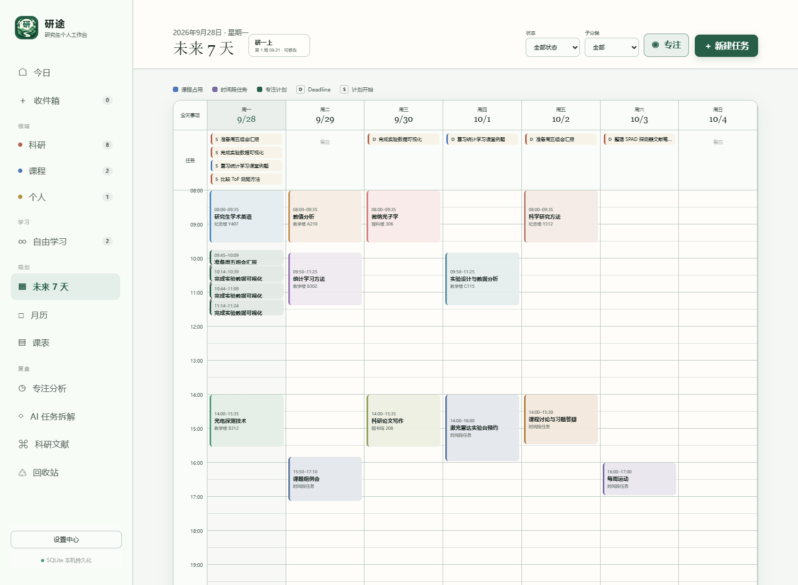

课表以周次、星期和节次呈现固定课程；今日页把课程占用与待完成任务放在同一个视野中。

| 课表周视图 | 今日工作面 |
| --- | --- |
| 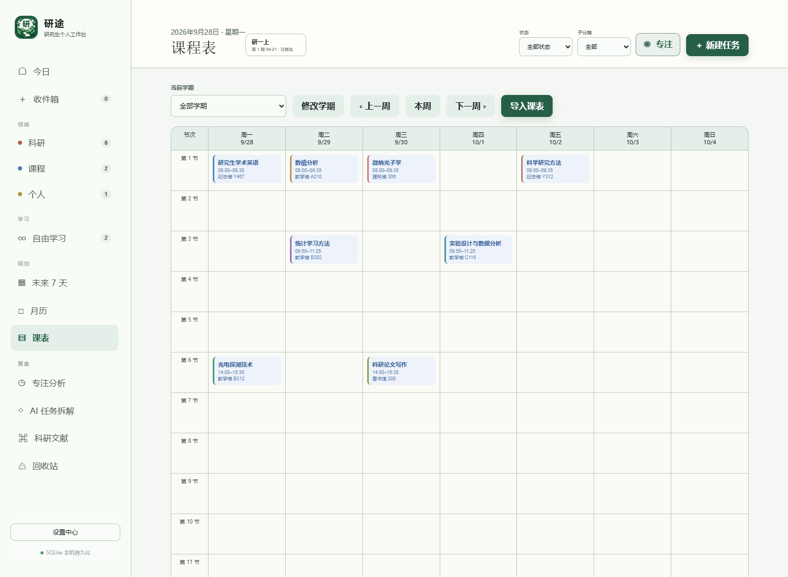 | 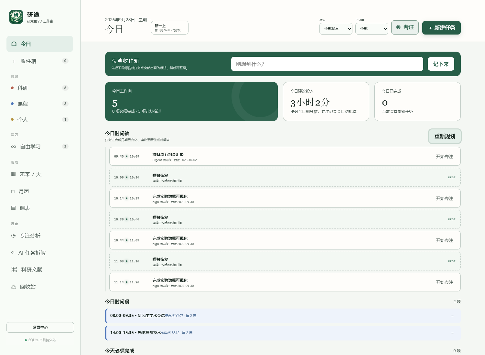 |

### 东南大学课表示意导入

目前针对东南大学课表常见的星期、节次、周次、单双周与多课次写法做了适配。以下截图使用虚构的东南大学字段示例 CSV，不是学校官方课表，也不代表每一种导出版式都能自动识别。导入时先填写学期，再核对可编辑的识别结果，最后才确认写入。CSV/XLSX 不需要 OCR；PDF 和图片需安装本地 OCR，识别结果尤其需要人工检查。

| 选择课表文件与学期 | 检查课程、时间与周次 |
| --- | --- |
| 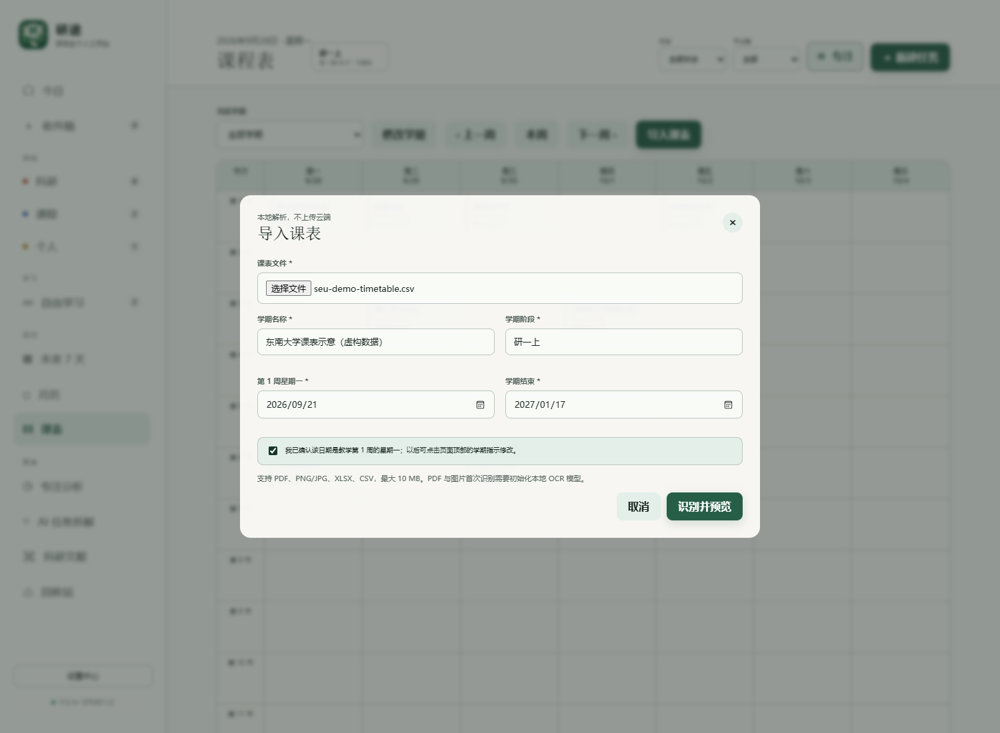 | 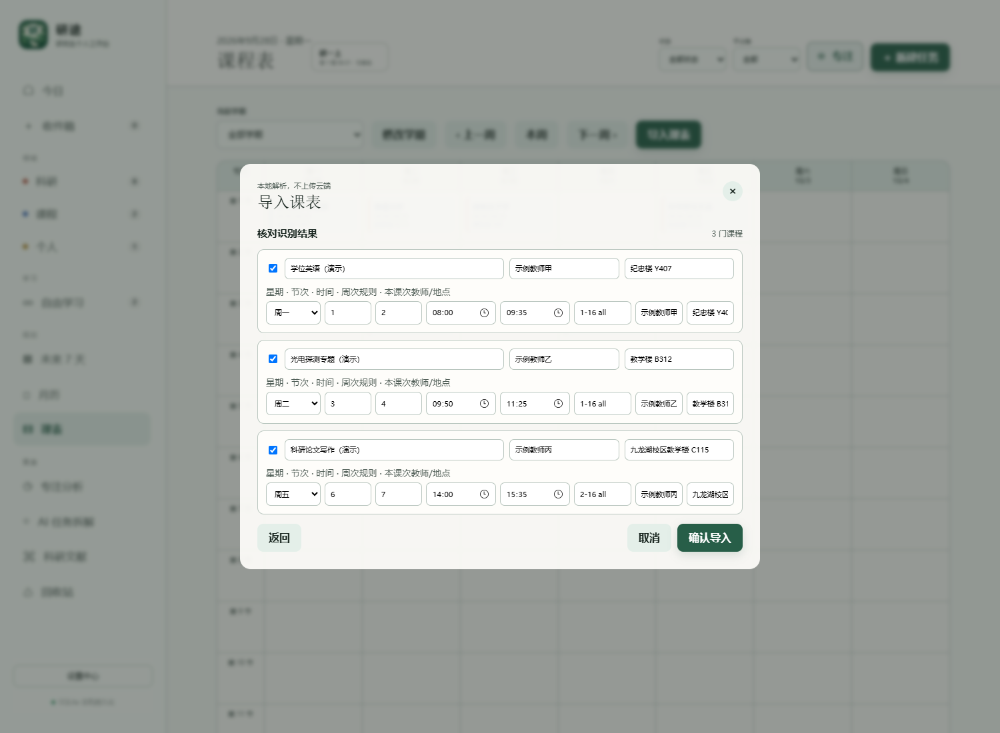 |

## 科研论文与自由学习

科研文献页可按 Zotero 文件夹或检索结果选择论文导入项目；同一篇论文的阅读任务可以继续推进，而不必每次重新建任务。下方导入预览使用演示接口数据，不连接真实文库。

| Zotero 论文选择预览 | 论文阅读与接续 |
| --- | --- |
| 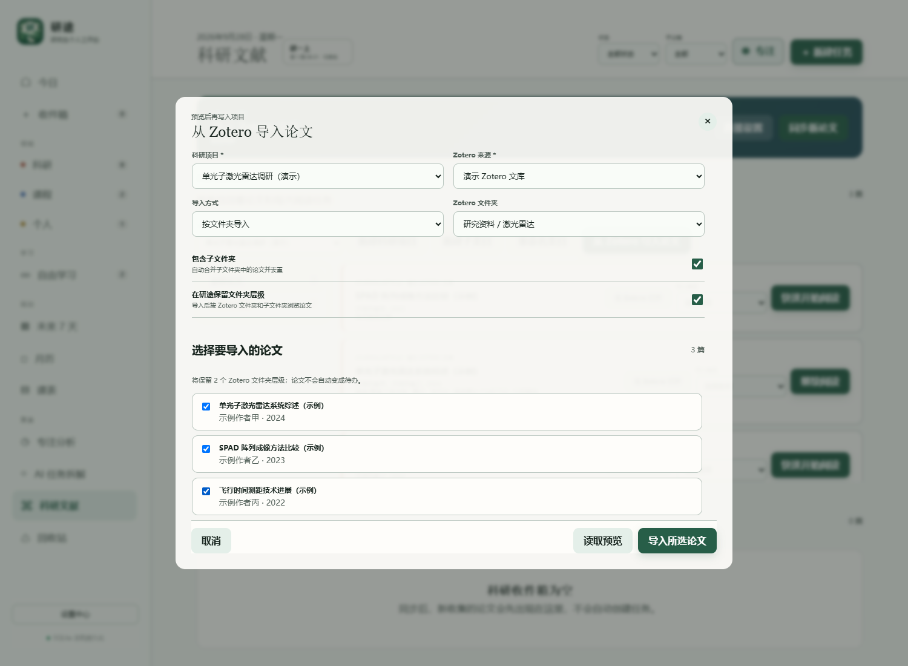 | 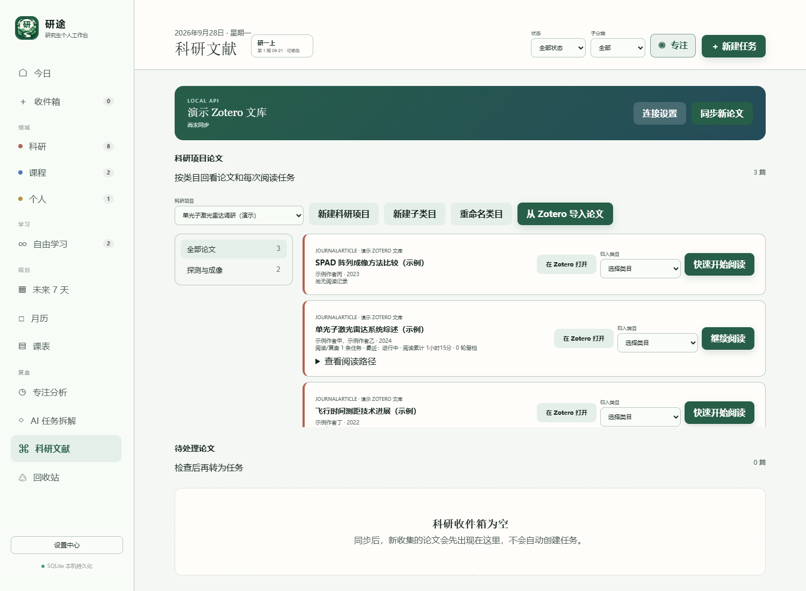 |

“自由学习”适合不按截止日期分摊的长期阅读或技能练习；任务上的“⋯”菜单提供专注、改期、复制、移动和回收站等快捷操作。

| 自由学习任务 | 快捷操作菜单 |
| --- | --- |
| 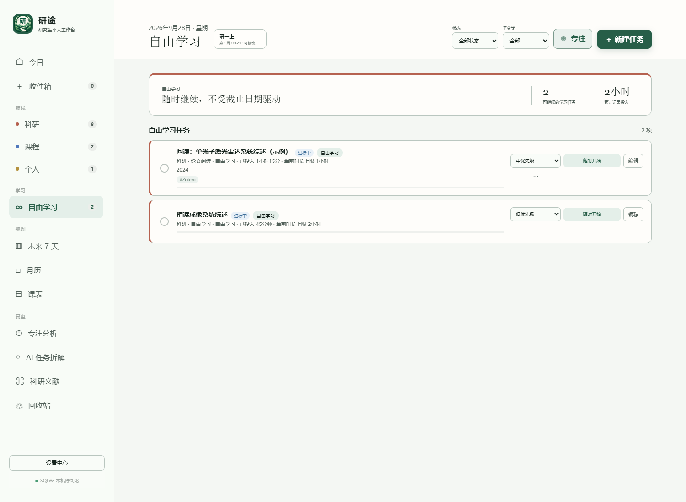 | 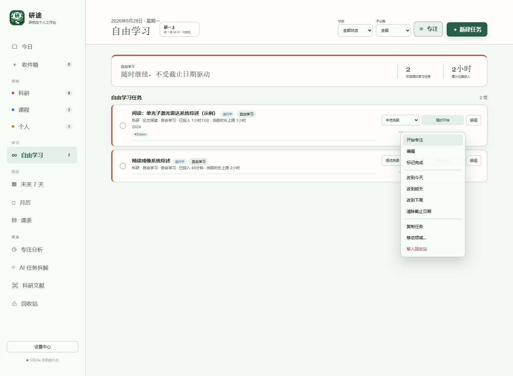 |

## 专注与复盘

专注工作台可选择番茄钟、规划偏好或自由计时；专注分析汇总历史投入、任务和时段分布。Windows 桌面版还可以手动打开固定在右下角的独立置顶小窗。小窗截图为真实界面的演示状态渲染，计时数字是模拟值。

| 专注工作台 | 历史投入分析 |
| --- | --- |
| 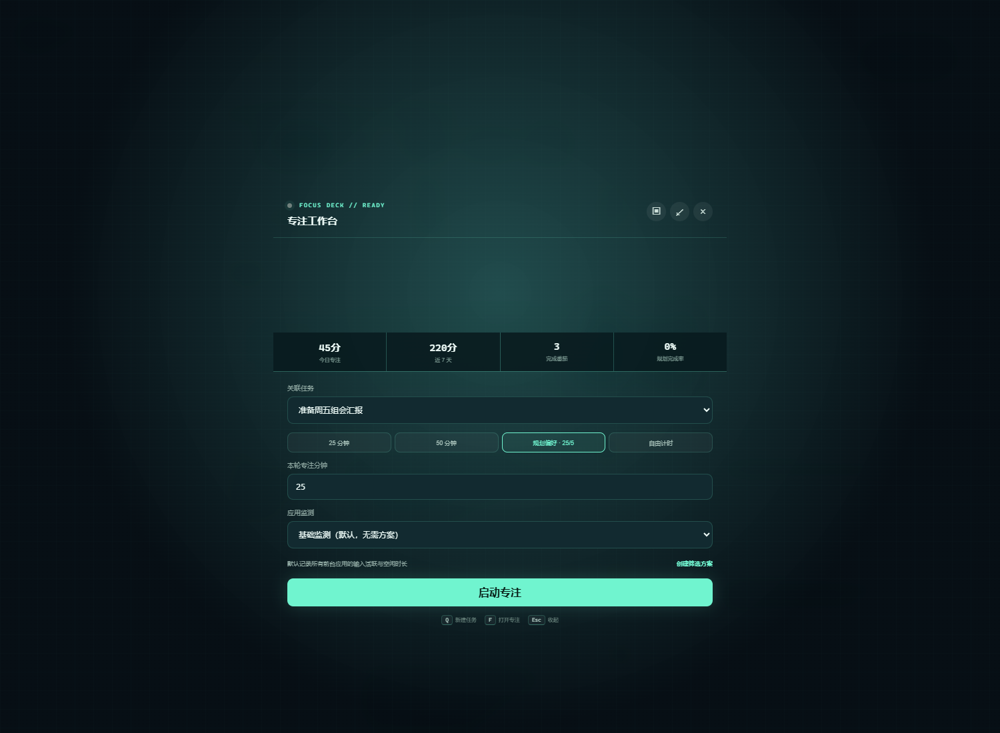 | 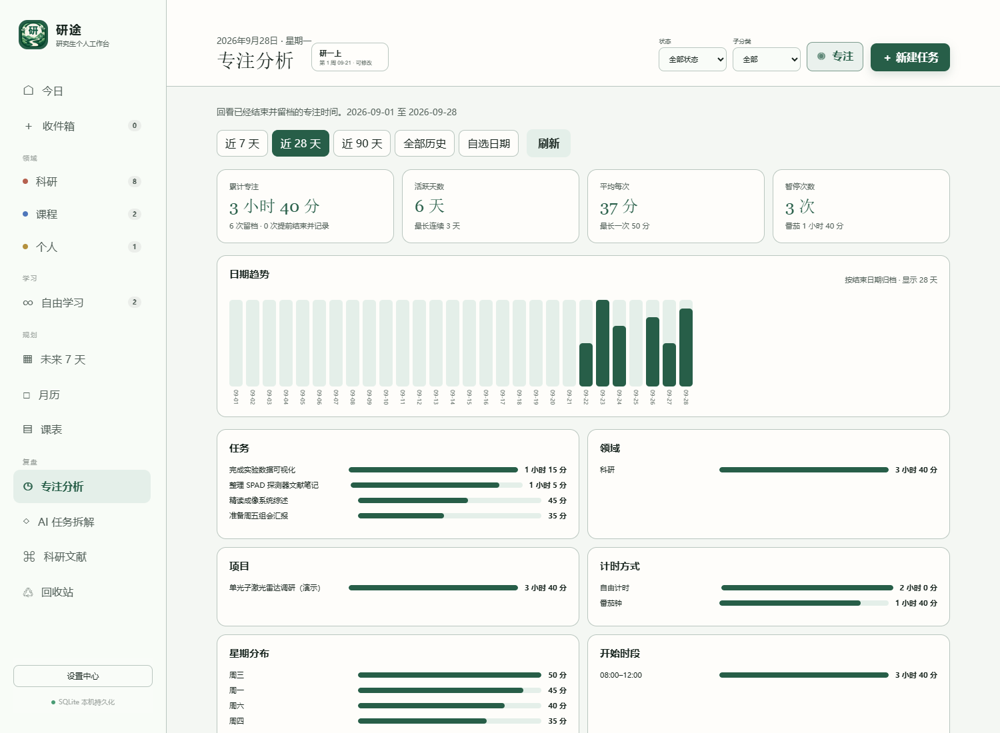 |

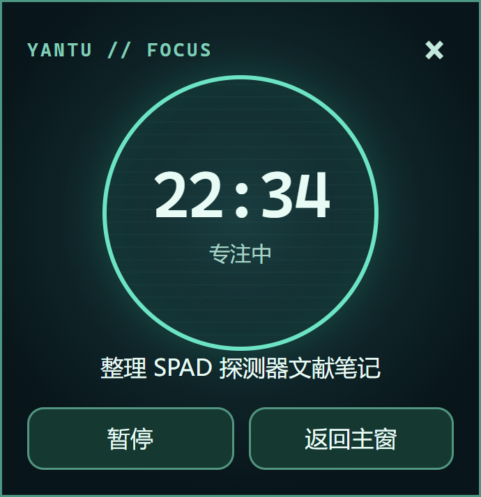

[返回 README](../README.md)
